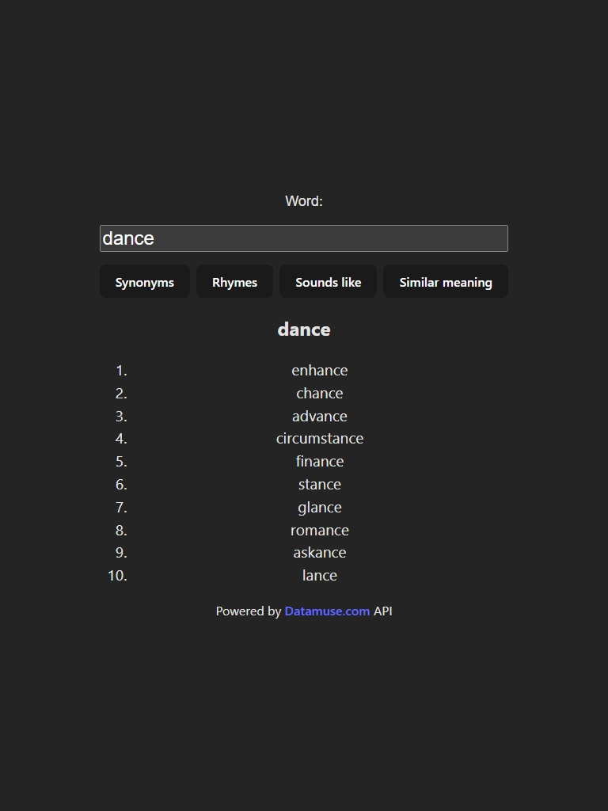

# Word-Search em API Datamuse

Uma pequena aplicação para mostrar como podem ser feitas requisições simples de API em React.

## 🗂️ Conteúdos

- [Resumo](#🤨-resumo)
    - [Objetivo](#🎯-objetivo)
    - [Screenshots](#💻-screenshots)
    - [Links](#🔗-link)
- [Meu Processo](#🧑🏻‍💻-meu-processo)
    - [Feito com](#🔧-feito-com)
    - [Futuras Implementações](#⏳-futuras-implementações)

## 🤨 Resumo

Uma pequena aplicação de requisições simples com o `fetch`, mostrando as possibilidades de requisição através de uma API e seu consequente tratamento de dados.

### 🎯 Objetivo

Obter uma página responsiva que conseguisse responder rapidamente as requisições e atualizasse os dados na tela.

### 💻 Screenshots

### 🔗 Link
- [word-searcher (Vercel)](https://word-searcher.vercel.app)

## 🧑🏻‍💻 Meu Processo

### 🔧 Feito com

- [ReactJS](https://reactjs.org/) - Framework
- [ViteJS](https://vitejs.dev) - Ferramenta de compilação
- [Datamuse](https://www.datamuse.com) - API de dicionário (em Inglês)
- [Visual Studio Code](https://code.visualstudio.com) - IDE

### ⏳ Futuras implementações

- [ ] Mais opções de botões
- [ ] Permitir solicitações mais complexas
- [ ] Ajuste visual para telas menores

#

#### 💻 Desenvolvido por Vinícius Fernandes

 